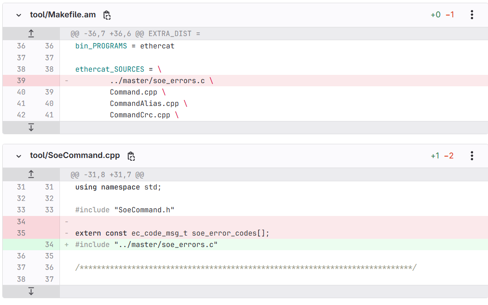

# Build EtherCAT from Source

After installing LinuxCNC, the next step is to install EtherCAT. Follow the procedure below:

## Initial Steps

If you have closed the command line, please run the LinuxCNC script again. If the command line is still open, you can skip this step and proceed directly to the EtherCAT installation.

For the LinuxCNC script:

1. Navigate to the LinuxCNC Source Folder

    ```bash
    cd /develop/linuxcnc-dev/src/
    ```

2. Run the LinuxCNC Script

    ```bash
    . ../scripts/rip-environment
    ```

## EtherCAT Installation

1. Change to the `develop` Folder

    ```bash
    cd ..
    cd ..
    ```

    Ensure you are in the `develop` folder so that the `ethercat-master` directory is created in the correct location.

2. Clone the EtherCAT Repository

    ```bash
    git clone https://gitlab.com/etherlab.org/ethercat.git ethercat-master
    ```

3. Navigate to the EtherCAT Folder

    ```bash
    cd ethercat-master
    ```

4. Switch to the Stable Branch

    ```bash
    git checkout stable-1.6
    ```

5. Build the Software as a Regular User

   ```bash
   ./bootstrap
   ```

   Get Ethernet Information:

   ```bash
   sudo lspci -v
   ```

   Configure for the Required Module Type:

   ```bash
   ./configure --sysconfdir=/etc/ --disable-8139too --enable-userlib --enable-generic
   ```

   Build All Modules:

   ```bash
   make all modules
   ```

   If the build fails and displays errors such as:

   ```text
   error: ethercat uses VFP register arguments, ../master/soe_errors.o does not
   warning: ../master/soe_errors.o uses 2-byte wchar_t yet the output is to use 4-byte wchar_t; use of wchar_t values across objects may fail
   ```

   Please follow these steps:

   Navigate to tool folder:

   ```bash
   cd tool/ 
   ```

   Edit Makefile.am:

   ```bash
   sudo geany Makefile.am
   ```

   `Remove` the line containing `../master/soe_errors.c` (typically `line 39`). Then, `save` the changes and `exit`.

   Edit SoeCommand.cpp:

   ```bash
   sudo geany SoeCommand.cpp
   ```

   `Remove` lines containing `extern const ec_code_msg_t soe_error_codes[]`; (typically line 35). 

   On line 34, add `#include "../master/soe_errors.c"`

   Then, save the changes and exit.

   

   Return to the EtherCAT Directory (ethercat-master):

   ```bash
   cd ..
   ```

   Clean the Build:

   ```bash
   make clean
   ```

   Reconfigure the Build Environment:

   ```bash
   ./bootstrap
   ./configure --sysconfdir=/etc/ --disable-8139too --enable-userlib --enable-generic
   ```

   Rebuild EtherCAT:

   ```bash
   make all modules
   ```

6. THEN INSTALL THE SOFTWARE AS ROOT

   SWITCH TO ROOT USER

   ```bash
   sudo su
   ```

   INSTALL THE MODULES AND SOFTWARE AS ROOT

   ```bash
   make modules_install install
   ```

   UPDATE MODULES DEPENDENCIES

   ```bash
   depmod
   ```

   EXIT ROOT USER

   ```bash
   exit
   ```

7. THEN GET SERVICE WORKING

   GET ETHER ADDRESS – WRITE DOWN OR COPY & PASTE THE MAC ADDRESS

   ```bash
   ip a
   ```

   ```bash
   sudo pico /etc/ethercat.conf
   ```

    ONCE THE FILE IS OPEN, SET YOUR MASTER0 DEVICE TO YOUR MAC ADDRESS AND DEVICE MODULES TO GENERIC.  SCROLL DOWN UNTIL YOU SEE THESE TWO PARTS.  (THEY ARE NOT TOGETHER, BUT SEPARATED THROUGHOUT THE CODE)

    ```text
    MASTER0_DEVICE="a1:b2:c3:d4:e5:f6"   (WHATEVER YOUR MAC ADDRESS IS)
    
    DEVICE_MODULES="generic"
    ```

    THEN SAVE AND EXIT PICO WITH `ctl o` AND `ctl x`.

    AFTER YOU HAVE EXITED PICO AND BACK ON THE COMMAND LINE

    ENABLE THE ETHERCAT SERVICE

    ```bash
    sudo systemctl enable ethercat.service
    ```

    START THE ETHERCAT SERVICE

    ```bash
    sudo systemctl start ethercat.service
    ```

    CHECK THE ETHERCAT STATUS

    ```bash
    sudo systemctl status ethercat.service
    ```

    CHANGE PERMISSIONS

    ```bash
    sudo chmod 666 /dev/EtherCAT0
    ```

    CHECK THAT ITS WORKING WITH

    ```bash
    ethercat master
    ```

    YOU SHOULD SEE NUMBERS IN THE LINES, IF NOT AND IT’S ALL ZERO’S THEN SOMETHING IS NOT LINKED CORRECTLY IN ETHERCAT OR LINUX.  MAKE SURE IT SHOWS A CHANGE AFTER DOING THE “ethercat master” COMMAND.

8. SETUP PERMISSION

    OPEN IN PICO TO GIVE ETHERCAT PORT STARTUP PERMISSION

    ```bash
    sudo pico /etc/udev/rules.d/99-ethercat.rules
    ```

    ONCE THE FILE IS OPEN, ADD THE FOLLOWING:

    ```text
    KERNEL=="EtherCAT[0-9]", MODE="0777"
    ```

    THEN SAVE AND EXIT PICO WITH `ctl + o` AND `ctl + x`.
    ONCE BACK ON THE COMMAND LINE, THEN RELOAD THE RULES

    ```bash
    sudo udevadm control --reload-rules
    ```

### SETUP LINUXCNC-ETHERCAT DRIVER

IF YOU DID CLOSE OUT THE COMMAND LINE FOR SOME REASON, GO RUN THE LINUXCNC SCRIPT.

IF YOUR COMMAND LINE IS STILL OPEN, THEN JUST SKIP DOWN PAST THIS AND START THE ETHERCAT DRIVER BUILD.

FOR THE LINUXCNC SCRIPT:

MOVE TO THE LINUXCNC SOURCE FOLDER

```bash
cd /linuxcnc-dev/src/
```

RUN THE LINUXCNC SCRIPT

```bash
. ../scripts/rip-environment
```

1. CHANGE BACK TO HOME FOLDER

    ```bash
    cd ..
    cd ..
    ```

2. CLONE THE ETHERCAT REPOSITORY.  JUST MAKE SURE YOU ARE IN THE HOME FOLDER AND NOT IN ANOTHER LOCATION SO THAT THE “linuxcnc-ethercat” FOLDER IS CREATED IN THE CORRECT LOCATION FOR THESE INSTRUCTIONS.

    ```bash
    git clone https://github.com/sittner/linuxcnc-ethercat.git linuxcnc-ethercat
    ```

3. NOW MOVE TO THE “src” FOLDER IN THE “linuxcnc-ethercat” FOLDER.

    ```bash
    cd /linuxcnc-ethercat/src
    ```

4. ONCE YOU ARE IN THE “src” FOLDER, NOW OVERWRITE THE “realtime.mk“ FILE WITH THE CODE BELOW.

    ```bash
    sudo geany realtime.mk
    ```

    ```text
    include ../config.mk
    include Kbuild

    cc-option = $(shell if $(CC) $(CFLAGS) $(1) -S -o /dev/null -xc /dev/null \
                > /dev/null 2>&1; then echo "$(1)"; else echo "$(2)"; fi;)

    .PHONY: all clean install

    ifeq ($(BUILDSYS),kbuild)
    module = $(patsubst %.o,%.ko,$(obj-m))

    ifeq (,$(findstring -Wframe-larger-than=,$(EXTRA_CFLAGS)))
    EXTRA_CFLAGS += $(call cc-option,-Wframe-larger-than=2560)
    endif

    $(module):
        $(MAKE) EXTRA_CFLAGS="$(EXTRA_CFLAGS)" KBUILD_EXTRA_SYMBOLS="$(RTLIBDIR)/Module.symvers $(RTAIDIR)/modules/ethercat/Module.symvers" -C $(KERNELDIR) SUBDIRS=`pwd` CC=$(CC) V=0 modules

    clean:
        rm -f $(obj-m)
        rm -f *.mod.c .*.cmd
        rm -f modules.order Module.symvers
        rm -rf .tmp_versions

    else
    module = $(patsubst %.o,%.so,$(obj-m))
    EXTRA_CFLAGS := $(filter-out -Wframe-larger-than=%,$(EXTRA_CFLAGS))

    $(module): $(lcec-objs)
        $(CC) -shared -o $@ $(lcec-objs) -Wl,-rpath,$(LIBDIR) -L$(LIBDIR) -llinuxcnchal -lethercat -lrt

    %.o: %.c
        $(CC) -o $@ $(EXTRA_CFLAGS) -Os -c $<
    
    endif

    all: $(module)

    clean:
        rm -f $(module)
        rm -f $(lcec-objs)

    install: $(module)
        mkdir -p $(DESTDIR)$(RTLIBDIR)
        cp $(module) $(DESTDIR)$(RTLIBDIR)/

    ```

    ONCE THE “realtime.mk” FILE HAS BEEN REPLACED WITH THE ABOVE CODE, THEN SAVE AND EXIT PICO WITH `ctl + o` AND `ctl + x`.

5. AFTER SAVING AND EXITING PICO, MOVE TO THE LINUXCNC-ETHERCAT FOLDER

    ```bash
    cd ..
    ```

    MAKE SURE YOU ARE IN THE “linuxcnc-ethercat” FOLDER, THEN MAKE CLEAN

    ```bash
    make clean
    ```

    THEN MAKE THE PACKAGE

    ```bash
    make
    ```

    **NOTE**: IF YOU HAVE A FAIL ON THE MAKE, THEN GO BACK TO THE “linuxcnc-dev/src” FOLDER AND DO THE “. ../scripts/rip-environment” AGAIN AND START LINUXCNC TO GET THE FILES LOADED

6. THEN DO THE INSTALL

    ```bash
    make install
    ```

7. EDIT THE FILE /etc/ld.so.conf AND ADD YOUR PATH

    ```bash
    sudo pico /etc/ld.so.conf 
    ```

8. ONCE THE FILE IS OPEN IN PICO, ADD THE FOLLOWING DOWN BELOW THE “INCLUDE” LINE

    ```text
    /usr/local/lib
    ```

    ONCE THE ABOVE HAD BEEN ADDED, THEN SAVE AND EXIT PICO WITH `ctl + o` AND `ctl + x`.

9. AFTER SAVING AND EXITING PICO, CHANGE TO ROOT

    ```bash
    sudo su
    ```

10. LOAD THE LIBRARY

    ```bash
    ldconfig -v
    ```

11. EXIT ROOT

    ```bash
    exit
    ```

IF YOU ARE USING CIA402 COMPATIBLE DRIVES:

RETURN TO `develop` FOLDER:

```bash
cd ~/develop
```

CLONE hal-cia402 REPO FROM dbraun:

```bash
git clone https://github.com/dbraun1981/hal-cia402.git
```

MOVE TO `hal-cia402` FOLDER:

```bash
cd hal-cia402
```

Install `cia402.comp`

```bash
halcompile --install cia402.comp
```
